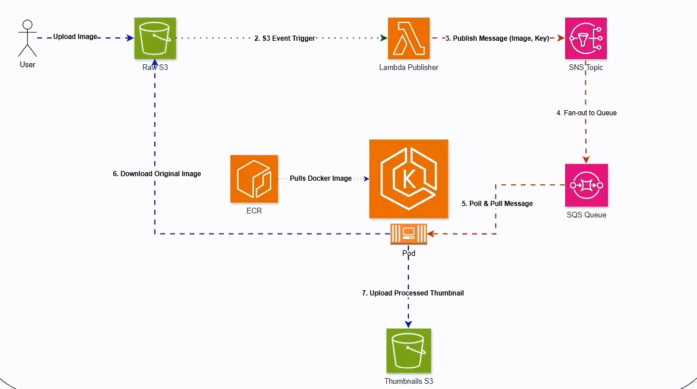

# 🖼️ Serverless Image Processing Pipeline with EKS Consumer

This project demonstrates a **cloud-native image processing pipeline** on **AWS**, combining **serverless services (Lambda, S3, SNS, SQS)** with a **containerized consumer running on Amazon EKS**. The solution is provisioned using **Terraform** and uses **Dockerized Python services** for image processing.

---

## 🚀 Architecture

The workflow consists of the following steps:

1.  **Upload** → A user uploads an image to the **Raw S3 Bucket** (`raw_bucket_name`).
2.  **Lambda Trigger** → An S3 event triggers a lightweight Lambda function that publishes the object key to an **SNS topic**.
3.  **Messaging Layer** → The SNS topic fans out the message to an **SQS Queue**, decoupling the system.
4.  **EKS Consumer** → A Python application running as a deployment on EKS polls the SQS queue for messages.
    -   It downloads the image from the raw bucket.
    -   It processes the image (e.g., resizes it).
    -   It uploads the resulting thumbnail to the **Thumbnail S3 Bucket** (`thumb_bucket_name`).

<p align="center">
  
</p>

---

## 📦 Components

-   **AWS Lambda**: Publishes S3 object keys to SNS upon image upload.
-   **Amazon SNS + SQS**: Decouples the event publishing from the consumption, ensuring durability and scalability.
-   **Amazon ECR**: Hosts the Docker image for the consumer application.
-   **Amazon EKS**: Provides the Kubernetes control plane to run the containerized consumer service.
-   **Amazon S3 Buckets**:
    -   `raw_bucket_name`: Stores the original, unprocessed images.
    -   `thumb_bucket_name`: Stores the generated thumbnails.

---

## 🛠️ Tech Stack

-   **Cloud Provider**: AWS
-   **Infrastructure as Code**: Terraform
-   **Containerization**: Docker
-   **Orchestration**: Amazon EKS (Kubernetes)
-   **Compute**: AWS Lambda, EKS Nodes
-   **Storage**: Amazon S3
-   **Messaging**: Amazon SNS, Amazon SQS
-   **Application**: Python

---

## ⚙️ Setup & Deployment

### 1️⃣ Prerequisites

-   An AWS account with administrative privileges.
-   Terraform (`>= 1.3`) installed.
-   Docker installed and running.
-   `kubectl` installed and configured.
-   AWS CLI installed and configured.

### 2️⃣ Deployment Steps

1.  **Clone the Repository**
    ```bash
    git clone [https://github.com/](https://github.com/)<your-username>/<repo-name>.git
    cd <repo-name>
    ```

2.  **Provision AWS Infrastructure**
    Navigate to the Terraform directory and deploy the resources. This will create the S3 buckets, SNS topic, SQS queue, ECR repository, and the EKS cluster.
    ```bash
    cd terraform
    terraform init
    terraform plan
    terraform apply --auto-approve
    ```

3.  **Build and Push the Docker Image**
    First, authenticate Docker with your Amazon ECR registry. Replace the placeholders with your specific values (you can get these from the Terraform outputs or your AWS console).
    ```bash
    # Authenticate Docker with ECR
    aws ecr get-login-password --region <your-aws-region> | docker login --username AWS --password-stdin <your-aws-account-id>.dkr.ecr.<your-aws-region>.amazonaws.com

    # Build the consumer app image
    cd ../consumer
    docker build -t <your-ecr-repo-name>:latest .

    # Tag the image for ECR
    docker tag <your-ecr-repo-name>:latest <your-aws-account-id>.dkr.ecr.<your-aws-region>[.amazonaws.com/](https://.amazonaws.com/)<your-ecr-repo-name>:latest

    # Push the image to ECR
    docker push <your-aws-account-id>.dkr.ecr.<your-aws-region>[.amazonaws.com/](https://.amazonaws.com/)<your-ecr-repo-name>:latest
    ```

4.  **Deploy the Consumer to EKS**
    First, configure `kubectl` to communicate with your new EKS cluster.
    ```bash
    # Update kubeconfig
    aws eks update-kubeconfig --region <your-aws-region> --name <your-eks-cluster-name>

    # Apply Kubernetes manifests
    cd ../k8s
    # NOTE: You may need to update the image path in deployment.yaml first!
    kubectl apply -f deployment.yaml
    kubectl apply -f service.yaml
    ```

5.  **Test the Pipeline**
    Upload a test image to the raw S3 bucket and then check the thumbnail bucket to see if the processed image appears.
    ```bash
    # Upload a test image
    aws s3 cp ./test-image.jpg s3://<raw_bucket_name>/

    # Check for the processed thumbnail (may take a moment)
    aws s3 ls s3://<thumb_bucket_name>/
    ```
---

# 🔍 Verification & Troubleshooting
Here are a few commands to help you check on the different parts of the pipeline.

**Check Lambda Logs**
Find your Lambda function's name from Terraform output and tail its logs in CloudWatch.

```bash

# Find lambda name
LAMBDA_NAME=$(terraform output -raw lambda_name 2>/dev/null || echo "<lambda-name>")
aws logs tail "/aws/lambda/${LAMBDA_NAME}" --since 5m
```

**Check Consumer Pod Logs**
Get the pod name and view the logs to ensure it's polling the queue and processing images.

```bash
# Get pod name
kubectl get pods -l app=image-consumer

# View logs for the consumer pods
kubectl logs -l app=image-consumer --tail=200
```

**Verify Thumbnail in S3**
List the contents of the thumbnail bucket to see the processed output.

```bash
# Note: Terraform does not create the 'thumbnails' prefix, your app does.
aws s3 ls s3://$(terraform output -raw thumb_bucket_name)/
```

**Check SQS Queue Metrics**
You can check the SQS queue for the approximate number of messages waiting to be processed.

```bash

QUEUE_URL=$(terraform output -raw sqs_queue_url)
aws sqs get-queue-attributes --queue-url "$QUEUE_URL" --attribute-names ApproximateNumberOfMessages
```
---

## 🗺️ Quick Reference

### Workflow Summary

`terraform apply` → `build & push docker image` → `kubectl apply` → **Done!**

* **Trigger**: Upload image to raw S3 bucket.
* **Path**: S3 → Lambda → SNS → SQS → EKS Consumer Pod.
* **Action**: Consumer reads from SQS, downloads from raw S3, processes, and uploads to thumbnail S3.
* **Result**: A thumbnail version of the image appears in the thumbnail bucket.

### Key Terraform Outputs

Your Terraform deployment will provide these crucial values. You will use them to build, push, and deploy your consumer application.

* `raw_bucket_name`
* `thumb_bucket_name`
* `sns_topic_arn`
* `sqs_queue_url`
* `ecr_repo_url`
* `eks_cluster_name`

---

## 📁 Project Structure
```bash
├── consumer/             # Python consumer app
│   ├── Dockerfile
│   ├── index.js
│   └── package.json
├── k8s/                  # Kubernetes manifests for EKS
│   ├── deployment.yaml
│   └── service.yaml
├── terraform/            # IaC for AWS infrastructure
│   ├── main.tf
│   ├── variables.tf
│   └── outputs.tf
├── docs/                 # Documentation assets
│   └── architecture.png
└── README.md             # Project documentation
```

---

## 📜 Deliverables

-   Infrastructure as Code (Terraform) for all AWS resources.
-   Dockerized Python consumer application.
-   Kubernetes deployment manifests for EKS.
-   Comprehensive documentation (this README) and an architecture diagram.

---

## 👤 Author

**Marwan Tamer**

*IEEE RAS | DevOps & Cloud Enthusiast*

---

## 📄 License

This project is licensed under the **MIT License** – feel free to use, adapt, and extend it.


---
